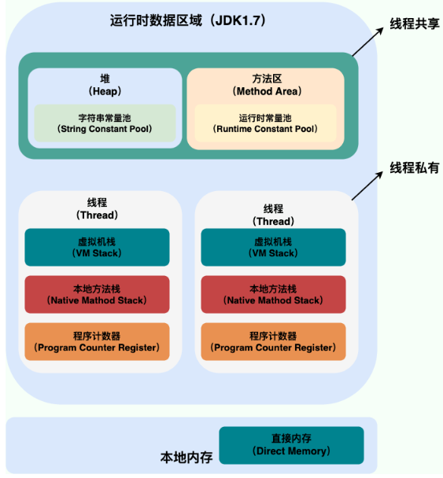

# Java内存区域
## 运行数据区域

JDK1.7

JDK1.8

# JVM回收

JDK1.7

- 新生代
- 老生代
- 永久代

JDK1.8

- 新生代
- 老生代
- 元空间

### 常见面试题

#### 如果判断一个常量为废弃常量

JDK1.7之前运行时常量池逻辑包含字符串常量池存放在方法区，此时hotspot对方法区的实现为永久代

JDK1.7字符串常量池被从方法区拿到了堆中，这里没有提高运行时常量池，也就是说字符串常量池被单独拿到了堆，运行常量池剩下的东西还在方法区，也就是永久代

JDK1.8 hotspot移除永久代用元空间代替，这个时候字符串常量池还在堆中，运行时常量池还在方法区，但方法区的实现从永生代变为了元空间。

假设字符串常量池中存在字符“abc”，如果当前没有任何String对象引用该常量，就说明此常量是废弃常量，如果此时发生内存回收的话而且有必要的话，“abc”就会被清楚

#### 如果判断一个类是无用的类

满足三个条件

1. 该类所有的实例都已经被回收，也就是Java堆中不存在该类的任何实例
2. 加载该类的classLoader被回收
3. 该类对应的java.lang.Class对象没有在任何地方被引用，无法在任何地方通过反射访问该类的方法

如果满足上述条件虚拟机可以对类进行回收，但并不是像对象一样不使用了就必然被回收