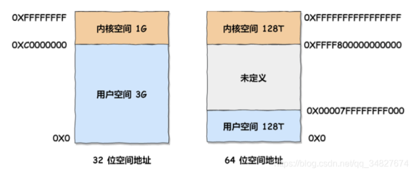

# 进程和线程

## 基本概念

进程：资源分配的基本单位，是调动运行的基本单位。在运行程序的时候，系统创建进程，分配资源，放入就绪队列，通过调度算法选中，分配cpu及相关资源，才运行。也就是说进程是系统中并发执行的单位。

线程：在采用微内核的系统中，线程变为资源调度的基本单位。此时并发执行的单位变为线程。

- 线程就是完成该进程的子任务之一
- 一个线程挂掉会导致整个进程挂掉
- 编程复杂，调试复杂
- 适用于多核分布式

## 进程的相关问题

### 进程之间的通信

1. 管道：

- 有名管道：半双工通信，但允许无亲属关系的进程通信，在go中通常用于协程之间的数据传递，同步等高级通信方式，比如生成者-消费者模式
- 无名管道：半双工通信，数据单向流动，仅在具有亲缘关系的进程间使用，通过用于两个不同进程之间的通信

2. 信号量
   计数器，控制多个线程对共享资源的访问，用于多线程之间的同步，通常作为一个锁机制，防止某一进程访问资源时其他进程也访问该资源，因此主要作为进程间以及同一进程内不同线程的同步手段
3. 信号
   用于通知接受进程某个事件已经发生
   比较复杂后面遇到再补充
4. 消息队列
   消息的链表，由消息队列标识符标识，unix下不同进程间可实现共享资源的一种机制。unix允许不同进程将格式化的数据流以消息队列发送给任意进程。
5. 共享内存
   映射一段能够被其他进程访问的内存，这段内存由一个进程创建，但多个进程都可以访问，是所有进程间通信方式（IPC）最快的
6. 套接字

## 线程的相关问题

### 线程之间的通信

1. 锁机制

- 互斥锁：提供了排他方式防止数据结构被并发修改
- 条件变量：原子操作阻塞进程，对条件的测试是再互斥锁的保护下进行，条件变量始终和互斥锁一起使用
- 读写锁：允许多个线程同时读共享数据，但对写操作是互斥的

2. 信号量机制：无名线程信号量和命名线程信号量
3. 信号机制：类似进程间的信号处理
   线程进行通信的目的是用于线程同步，所欲线程没有像进程通信中的用于数据交换的通信机制

## 一个进程最多可以创建多少线程？

首先需要考虑：

- 进程的虚拟内存空间上限：因为创建线程会开辟栈，占用虚拟内存。虚拟空间通常被分为内核空间和用户空间两部分
- 系统参数限制

不同位数linux系统中，地址空间不一样

比如32位linux系统中，一个进程的虚拟空间是4G，内核是1G，剩余3G，可以采用ulimit -a查看stack size，假设一个线程占用10M的虚拟空间，那就是3G/10M=300个线程

在64位操作系统中，如果按照10M的线程虚拟内存占用理论上可以创建无数个线程
但是下面三个内核参数的大小会限制线程的上线
- /proc/sys/kernel/threads-max：系统支持的最大线程数，默认值14553
- /proc/sys/kernel/pid_max：系统全局PID号数值的限制，每个进程或线程都有ID，默认32768
- /proc/sys/vm/max_map_count：表示一个进程可以拥有的虚拟内存区域的数量，默认65530